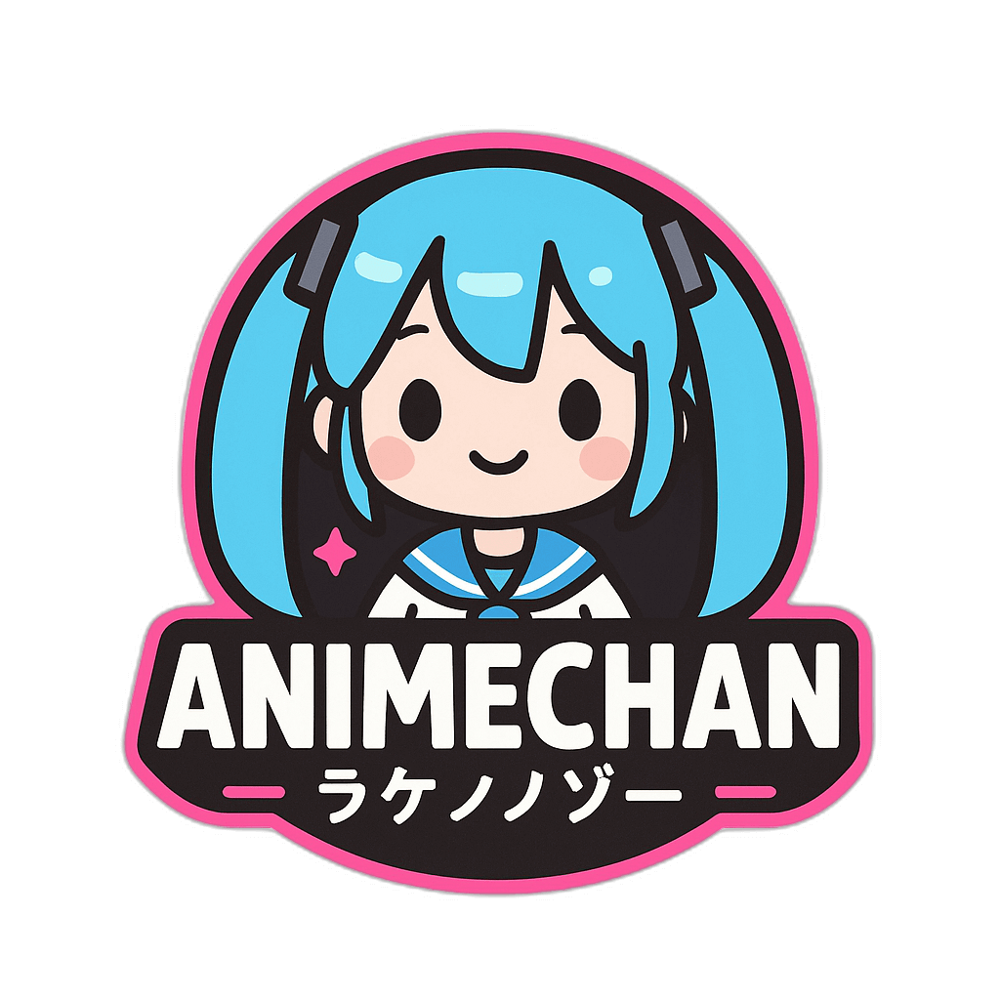

 

  
  <h3 align="center">Animechan</h3>
  

    <a href="https://github.com/Animechan-API/animechan/discussions/65">Anime request</a>
    |
    <a href="https://github.com/Animechan-API/animechan/issues">Bug report</a>
    |
    <a href="https://github.com/Animechan-API/animechan/issues">Feature request</a>
  

## About

 

Animechan is an anime quotes and information API service that provides developers with access to a vast curated collection of anime content. Our API delivers episode counts, detailed show summaries, character information, and memorable quotes from thousands of anime series.

## License

[MPL-2.0 license](./LICENSE) © 2024 [Rocktim Saikia](https://rocktimsaikia.dev)
