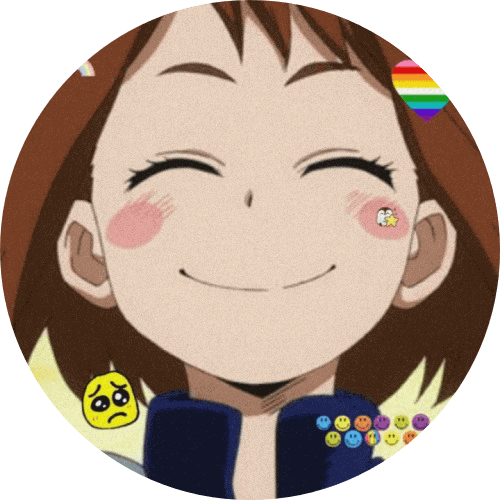

  
  
  
  
</a>

<!-- PROJECT LOGO -->
 

  

  <h3 align="center">Animechan</h3>

  

    A free restful API serving quality anime quotes
     
    <a href="https://animechan.vercel.app/"><strong>Explore the api »</strong></a>
     
     
    <a href="https://github.com/RocktimSaikia/anime-chan/issues/39">Anime request</a>
    ·
    <a href="https://github.com/rocktimsaikia/anime-chan/issues">anime-chan Bug</a>
    ·
    <a href="https://github.com/rocktimsaikia/anime-chan/issues">Request Feature</a>
  

<!-- TABLE OF CONTENTS -->

  
<h2 style="display: inline-block">Table of Contents</h2>

  <ol>
    <li><a href="#about">About</a></li>
    <li><a href="#background">Background</a></li>
    <li><a href="#support">Support</a></li>
    <li><a href="#contributing">Contributing</a></li>
    <li><a href="#copyright">Copyright</a></li>
  </ol>

## About
Animechan is free restful API that serves thousands of anime quotes every minute. It is built with:

* [Next.js](https://nextjs.org/)
* [Koa.js](https://koajs.com/)
* [TailwindCSS](https://tailwindcss.com/)

> Join the [Discord server](https://discord.gg/zjVWGTAVyC) for upcoming updates or just to say Hi.

<!-- ABOUT THE PROJECT -->
## Background

I started Animechan as a side project almost a year ago because of the frustration of not finding a single API service that provides anime quotes. So I created Animechan but left it halfway due to my internship but the traffic the API received was pretty huge. Also due to recent emails and issues where people kept on telling me to keep the service alive I recently decided to work on it. I recreated the entire API from scratch as the old API was poorly designed. Main reason for that is I didn't have much experience in designing API back then.

<!-- USAGE EXAMPLES -->
## Support

This project is completely free to use and it's solely maintained by me, from front-end to back-end to frequent database updates, which takes a lot of my time. That is also the reason I stopped maintaining it for a long time. So to keep the API free forever, please consider donating. That would be **greatly appreciated**.

<!-- CONTRIBUTING -->
## Contributing

- For new Anime requests please [add comments here](https://github.com/RocktimSaikia/anime-chan/issues/39).
- And for any bug or feature requests, [Submit a issue here](https://github.com/RocktimSaikia/anime-chan/issues).

Also please see the [open issues](https://github.com/rocktimsaikia/anime-chan/issues) for a list of proposed features before submitting one.

<!-- LICENSE -->
## Copyright

Copyright © [rocktimsaikia](https://rocktimsaikia.now.sh) 2021.
